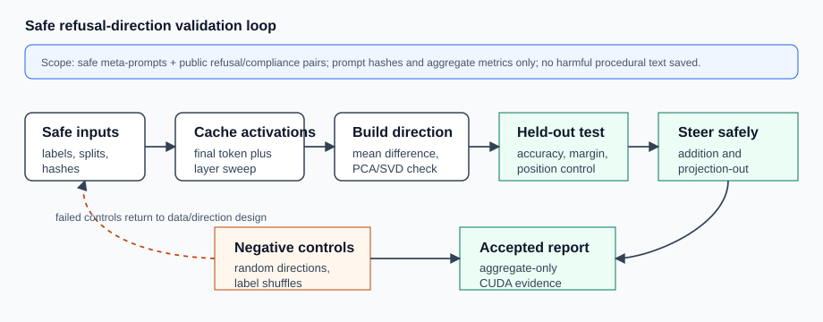
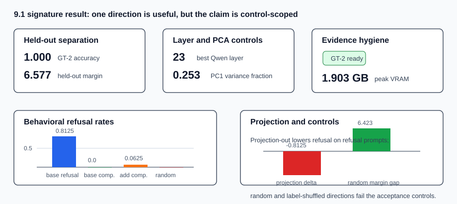

# [9.1] Refusal Directions and Safe Steering

> **Notebooks: [exercises](../../exercises/part1_refusal_directions_safe_steering/9.1_Refusal_Directions_and_Safe_Steering_exercises.ipynb) | [solutions](../../exercises/part1_refusal_directions_safe_steering/9.1_Refusal_Directions_and_Safe_Steering_solutions.ipynb)**

> **Local-first extension.** This section builds a safe refusal-direction and
> steering validation ladder. The exercises start with toy activations so you
> can implement the contract, then the committed CUDA report checks the same
> ideas on pinned Pythia/Qwen paths and a public refusal/compliance dataset.

```python
GT_TIER = "GT-2"
EXERCISE_ID = "9_1_refusal_directions_and_safe_steering"
EXPECTED_RUNTIME = "seconds for toy contracts; minutes for the CUDA real-model preflights"
REQUIRES_GPU = True  # full acceptance uses pinned Pythia/Qwen plus GT-2 dataset CUDA preflights
```

Please send any problems / bugs on the `#errata` channel in the [Slack group](https://info-arena.github.io/ARENA_img/slack.html), and ask any questions on the dedicated channels for this chapter of material.

If you want to change to dark mode, you can do this by clicking the three horizontal lines in the top-right, then navigating to Settings -> Theme.

Links to earlier chapters: [(0) Fundamentals](https://arena-chapter0-fundamentals.streamlit.app/), [(1) Transformer Interpretability](https://arena-chapter1-transformer-interp.streamlit.app/), [(2) RL](https://arena-chapter2-rl.streamlit.app/), [(3) LLM Evaluations](https://arena-chapter3-llm-evals.streamlit.app/), [(4) Alignment Science](https://arena-chapter4-alignment-science.streamlit.app/).


# Introduction


Refusal-direction analysis asks whether a model has a direction in activation
space that separates refusal-like behavior from non-refusal behavior. The
tempting claim is "refusal is one-dimensional." The claim we will actually
earn is narrower: one direction can be a useful, testable control knob when it
passes held-out, intervention, random-direction, and label-shuffle checks.

This section keeps the task safe and local. The toy exercises use synthetic
activations; the full experiment path uses sanitized meta-prompts plus the
public `josephmayo/refusal-compliance-pairs` refusal/compliance dataset. Do not
write or display harmful procedural prompt text for this exercise. The release
verification stores only aggregate metrics and prompt hashes; generated
completion text is not saved.

The verification contract is:

```text
direction separates refusal vs non-refusal prompts
steering changes refusal rate on safe benchmark
general capability degradation is small
random directions fail
```



The rhythm is the same as the original ARENA circuit material: build a tiny
version, make the score visible, break it with controls, then inspect the
real-model evidence with strict claim boundaries.


## Content & Learning Objectives

### 1. Safe prompt pairs and activation caches

You will keep prompt content safe, separate train/held-out examples, and treat
cached residual activations as the object being interpreted.

> ##### Learning Objectives
>
> * Build refusal/compliance prompt pairs without displaying harmful procedural text.
> * Cache one activation vector per example at a named layer and position.
> * Keep raw prompts and completions out of committed course artifacts.

### 2. Candidate refusal directions

You will compute a normalized mean-difference refusal direction, then compare
candidate methods by the same held-out scoring contract.

> ##### Learning Objectives
>
> * Build a normalized refusal-minus-non-refusal direction.
> * Use margin and accuracy, not only qualitative inspection.
> * Treat layer and position choices as hypotheses to test, not constants to trust.

### 3. Separation, steering, and projection-out

You will test whether the direction separates held-out examples, whether adding
it increases refusal evidence where expected, and whether projection-out lowers
refusal evidence on refusal-labeled examples.

> ##### Learning Objectives
>
> * Measure refusal-rate change directly.
> * Test addition and projection-out separately in a full experiment.
> * Keep steering behavior scoped to benign benchmark examples.

### 4. Controls and interpretation

You will reject explanations that are matched by random directions,
label-shuffled directions, or broad capability collapse.

> ##### Learning Objectives
>
> * Require small general capability degradation.
> * Use random-direction and label-shuffle controls.
> * Read PCA/SVD structure as supporting geometry evidence, not proof of broad safety.


## Setup code


```python
import sys
from pathlib import Path

import torch as t

chapter = "chapter9_alignment_interpretability"
section = "part1_refusal_directions_safe_steering"
root_dir = next(p for p in [Path.cwd(), *Path.cwd().parents] if (p / chapter).exists())
exercises_dir = root_dir / chapter / "exercises"
section_dir = exercises_dir / section

if str(root_dir) not in sys.path:
    sys.path.append(str(root_dir))
if str(exercises_dir) not in sys.path:
    sys.path.append(str(exercises_dir))

import part1_refusal_directions_safe_steering.tests as tests
import part1_refusal_directions_safe_steering.utils as utils

from arena_ext.refusal_steering import (
    capability_degradation_report,
    direction_comparison_report,
    label_shuffle_control_report,
    mean_difference_direction,
    random_direction_control_report,
    refusal_direction_scores,
    refusal_separation_report,
    steering_effect_report,
)

MAIN = __name__ == "__main__"
```


# Candidate refusal directions


### Exercise - compute a mean-difference direction

> ```yaml
> Difficulty: easy
> Importance: high
>
> You should spend up to 5 mins on this exercise.
> ```

A mean-difference direction points from non-refusal examples toward refusal
examples.

```python
refusal = t.tensor([[2.0, 0.0], [2.0, 1.0]])
non_refusal = t.tensor([[0.0, 0.0], [0.0, 1.0]])

direction = mean_difference_direction(refusal, non_refusal)

assert direction.tolist() == [1.0, 0.0]


def direction_smoke_test() -> list[float]:
    refusal = t.tensor([[2.0, 0.0], [2.0, 1.0]])
    non_refusal = t.tensor([[0.0, 0.0], [0.0, 1.0]])
    return mean_difference_direction(refusal, non_refusal).tolist()


tests.test_direction_smoke_test(direction_smoke_test)
```

<details>
<summary>Expected output</summary>

```text
All tests in `test_direction_smoke_test` passed!
```

</details>

<details>
<summary>Common bugs</summary>

- Forgetting to normalize the mean-difference vector.
- Subtracting refusal from non-refusal and flipping the sign.
- Mixing refusal and non-refusal examples before computing class means.

</details>

<details>
<summary>Help - why mean difference?</summary>

Mean difference is the simplest possible linear direction: average the
refusal-labeled activations, average the non-refusal activations, subtract, and
normalize. It is not automatically the "true refusal feature." It is a
candidate direction whose value comes from the tests that follow: held-out
separation, layer and position sweeps, steering, and negative controls.

</details>

<details>
<summary>Solution</summary>

```python
def direction_smoke_test() -> list[float]:
    refusal = t.tensor([[2.0, 0.0], [2.0, 1.0]])
    non_refusal = t.tensor([[0.0, 0.0], [0.0, 1.0]])
    return mean_difference_direction(refusal, non_refusal).tolist()
```

</details>


# Separation checks


### Exercise - score activations on the refusal direction

> ```yaml
> Difficulty: easy
> Importance: medium
>
> You should spend up to 5 mins on this exercise.
> ```

Projection scores are the basic readout for a candidate direction.

```python
activations = t.tensor([[2.0, 0.0], [0.5, 1.0]])
direction = t.tensor([1.0, 0.0])

scores = refusal_direction_scores(activations, direction)

assert scores.tolist() == [2.0, 0.5]


def scores_smoke_test() -> list[float]:
    activations = t.tensor([[2.0, 0.0], [0.5, 1.0]])
    direction = t.tensor([1.0, 0.0])
    return refusal_direction_scores(activations, direction).tolist()


tests.test_scores_smoke_test(scores_smoke_test)
```

<details>
<summary>Expected output</summary>

```text
All tests in `test_scores_smoke_test` passed!
```

</details>

<details>
<summary>Common bugs</summary>

- Treating scores as probabilities rather than signed projections.
- Forgetting that the direction should be normalized before interpretation.
- Returning a tensor object where the notebook contract expects a list.

</details>

<details>
<summary>Help - what should the scores mean?</summary>

The score is a signed projection. A larger score should mean "more refusal-like"
only after you have chosen the sign convention and checked that refusal examples
have higher mean score than non-refusal examples. This is why the next exercise
requires both accuracy and a positive margin.

</details>

<details>
<summary>Solution</summary>

```python
def scores_smoke_test() -> list[float]:
    activations = t.tensor([[2.0, 0.0], [0.5, 1.0]])
    direction = t.tensor([1.0, 0.0])
    return refusal_direction_scores(activations, direction).tolist()
```

</details>


### Exercise - report refusal separation

> ```yaml
> Difficulty: medium
> Importance: high
>
> You should spend up to 10 mins on this exercise.
> ```

The direction should separate refusal-labeled examples from non-refusal examples.

```python
activations = t.tensor([[2.0, 0.0], [3.0, 0.0], [0.0, 0.0], [0.5, 0.0]])
labels = t.tensor([1, 1, 0, 0], dtype=t.bool)
direction = t.tensor([1.0, 0.0])

report = refusal_separation_report(
    activations,
    labels,
    direction,
    min_accuracy=0.9,
)

utils.print_report("Refusal separation", report.__dict__)

assert report.separates_refusal


def separation_smoke_test() -> dict:
    activations = t.tensor([[2.0, 0.0], [3.0, 0.0], [0.0, 0.0], [0.5, 0.0]])
    labels = t.tensor([1, 1, 0, 0], dtype=t.bool)
    direction = t.tensor([1.0, 0.0])
    return refusal_separation_report(
        activations,
        labels,
        direction,
        min_accuracy=0.9,
    ).__dict__


tests.test_separation_smoke_test(separation_smoke_test)
```

<details>
<summary>Expected output</summary>

```text
accuracy: 1.0
margin: 2.25
All tests in `test_separation_smoke_test` passed!
```

</details>

<details>
<summary>Common bugs</summary>

- Reporting only accuracy and missing the signed score margin.
- Using training examples as held-out evidence in the full experiment.
- Treating a negative-margin separator as a valid refusal direction.

</details>

<details>
<summary>Interpreting the separation report</summary>

Perfect toy accuracy is not the result we care about; it is the implementation
check. In the real report, the analogous GT-2 check is held-out Qwen accuracy
`1.0` with margin `6.576968312263489`, after learning the direction on separate
train prompts from the public refusal/compliance dataset.

</details>

<details>
<summary>Solution</summary>

```python
def separation_smoke_test() -> dict:
    activations = t.tensor([[2.0, 0.0], [3.0, 0.0], [0.0, 0.0], [0.5, 0.0]])
    labels = t.tensor([1, 1, 0, 0], dtype=t.bool)
    direction = t.tensor([1.0, 0.0])
    return refusal_separation_report(
        activations,
        labels,
        direction,
        min_accuracy=0.9,
    ).__dict__
```

</details>


# Safe steering effects


### Exercise - measure refusal-rate steering

> ```yaml
> Difficulty: medium
> Importance: high
>
> You should spend up to 10 mins on this exercise.
> ```

The safe benchmark stores refusal scores, not harmful content. Steering should
change the refusal rate in the expected direction.

```python
baseline = t.tensor([0.2, 0.4, 0.7])
steered = t.tensor([0.8, 0.9, 0.4])

report = steering_effect_report(
    baseline,
    steered,
    threshold=0.5,
    expected_direction="increase",
    min_rate_delta=0.3,
)

assert report.changes_refusal_rate


def steering_smoke_test() -> dict:
    baseline = t.tensor([0.2, 0.4, 0.7])
    steered = t.tensor([0.8, 0.9, 0.4])
    return steering_effect_report(
        baseline,
        steered,
        threshold=0.5,
        expected_direction="increase",
        min_rate_delta=0.3,
    ).__dict__


tests.test_steering_smoke_test(steering_smoke_test)
```

<details>
<summary>Expected output</summary>

```text
baseline_refusal_rate: 0.333...
steered_refusal_rate: 0.666...
All tests in `test_steering_smoke_test` passed!
```

</details>

<details>
<summary>Common bugs</summary>

- Counting raw score deltas instead of thresholded refusal-rate changes.
- Forgetting to specify whether steering should increase or decrease refusal.
- Treating a large steering effect as sufficient without capability controls.

</details>

<details>
<summary>Help - addition versus projection-out</summary>

Addition asks whether moving along the direction increases refusal evidence.
Projection-out asks whether removing the direction decreases refusal evidence.
These are different causal checks. A direction that only separates examples but
does not change behavior under intervention is probably a readout direction, not
a useful steering direction.

</details>

<details>
<summary>Solution</summary>

```python
def steering_smoke_test() -> dict:
    baseline = t.tensor([0.2, 0.4, 0.7])
    steered = t.tensor([0.8, 0.9, 0.4])
    return steering_effect_report(
        baseline,
        steered,
        threshold=0.5,
        expected_direction="increase",
        min_rate_delta=0.3,
    ).__dict__
```

</details>


# Capability and random controls


### Exercise - bound general capability degradation

> ```yaml
> Difficulty: easy
> Importance: high
>
> You should spend up to 5 mins on this exercise.
> ```

Steering should not collapse general capability on ordinary benign tasks.

```python
baseline = t.tensor([0.9, 0.8])
steered = t.tensor([0.85, 0.75])

report = capability_degradation_report(
    baseline,
    steered,
    max_degradation=0.1,
)

assert report.degradation_small


def capability_smoke_test() -> dict:
    baseline = t.tensor([0.9, 0.8])
    steered = t.tensor([0.85, 0.75])
    return capability_degradation_report(
        baseline,
        steered,
        max_degradation=0.1,
    ).__dict__


tests.test_capability_smoke_test(capability_smoke_test)
```

<details>
<summary>Expected output</summary>

```text
degradation: 0.05
All tests in `test_capability_smoke_test` passed!
```

</details>

<details>
<summary>Common bugs</summary>

- Measuring only refusal-rate improvement and ignoring benign-task performance.
- Computing absolute score changes instead of baseline minus steered capability.
- Setting the capability bound after seeing the result.

</details>

<details>
<summary>Interpreting capability controls</summary>

Capability controls keep the result from becoming "we made the model worse and
therefore it refuses differently." In this section the toy capability check is
deliberately simple, while the report records behavioral accuracy `0.90625` on
the public GT-2 completion diagnostic and keeps the raw completion text out of
the artifact.

</details>

<details>
<summary>Solution</summary>

```python
def capability_smoke_test() -> dict:
    baseline = t.tensor([0.9, 0.8])
    steered = t.tensor([0.85, 0.75])
    return capability_degradation_report(
        baseline,
        steered,
        max_degradation=0.1,
    ).__dict__
```

</details>


### Exercise - compare against random directions

> ```yaml
> Difficulty: easy
> Importance: high
>
> You should spend up to 5 mins on this exercise.
> ```

Random directions should not match the target refusal direction.

```python
report = random_direction_control_report(
    target_direction_delta=0.4,
    random_direction_delta=0.05,
    min_margin=0.2,
)

assert report.random_direction_fails


def random_control_smoke_test() -> dict:
    return random_direction_control_report(
        target_direction_delta=0.4,
        random_direction_delta=0.05,
        min_margin=0.2,
    ).__dict__


tests.test_random_control_smoke_test(random_control_smoke_test)
```

<details>
<summary>Expected output</summary>

```text
margin: 0.35
All tests in `test_random_control_smoke_test` passed!
```

</details>

<details>
<summary>Common bugs</summary>

- Comparing the target direction only to zero instead of a random-direction baseline.
- Using a random baseline without a fixed seed in the full experiment.
- Calling the target direction meaningful when it misses the required margin.

</details>

<details>
<summary>Help - why random directions are not optional</summary>

High-dimensional spaces contain many directions that move scores. You only get
to call the refusal direction meaningful if the target direction beats matched
random directions under the same metric and sign convention. The GT-2 report's
random margin gap is `6.42253303527832`.

</details>

<details>
<summary>Solution</summary>

```python
def random_control_smoke_test() -> dict:
    return random_direction_control_report(
        target_direction_delta=0.4,
        random_direction_delta=0.05,
        min_margin=0.2,
    ).__dict__
```

</details>


### Exercise - reject label-shuffled directions

> ```yaml
> Difficulty: easy
> Importance: high
>
> You should spend up to 5 mins on this exercise.
> ```

A label-shuffled direction should not recover the same signed refusal
separation. This catches a common failure mode where the dataset is easy to
separate for reasons unrelated to the intended labels.

```python
activations = t.tensor([[3.0, 0.0], [2.5, 0.0], [0.0, 0.0], [0.2, 0.0]])
labels = t.tensor([1, 1, 0, 0], dtype=t.bool)

report = label_shuffle_control_report(
    activations,
    labels,
    min_accuracy_gap=0.25,
)

assert report.label_shuffle_fails


def label_shuffle_smoke_test() -> dict:
    activations = t.tensor([[3.0, 0.0], [2.5, 0.0], [0.0, 0.0], [0.2, 0.0]])
    labels = t.tensor([1, 1, 0, 0], dtype=t.bool)
    return label_shuffle_control_report(
        activations,
        labels,
        min_accuracy_gap=0.25,
    ).__dict__


tests.test_label_shuffle_smoke_test(label_shuffle_smoke_test)
```

<details>
<summary>Expected output</summary>

```text
true_accuracy: 1.0
shuffled_accuracy: <= 0.5
All tests in `test_label_shuffle_smoke_test` passed!
```

</details>

<details>
<summary>Common bugs</summary>

- Treating an easy dataset direction as aligned without a label-shuffle control.
- Shuffling activations instead of labels and accidentally preserving the pairing.
- Forgetting to report both true and shuffled accuracies.

</details>

<details>
<summary>Interpreting label shuffles</summary>

Label-shuffle controls ask whether the dataset is separable for the intended
reason. If a shuffled-label direction performs almost as well as the true
direction, you may be measuring formatting, length, category order, or some
other shortcut rather than refusal.

</details>

<details>
<summary>Solution</summary>

```python
def label_shuffle_smoke_test() -> dict:
    activations = t.tensor([[3.0, 0.0], [2.5, 0.0], [0.0, 0.0], [0.2, 0.0]])
    labels = t.tensor([1, 1, 0, 0], dtype=t.bool)
    return label_shuffle_control_report(
        activations,
        labels,
        min_accuracy_gap=0.25,
    ).__dict__
```

</details>


### Exercise - compare direction construction methods

> ```yaml
> Difficulty: easy
> Importance: medium
>
> You should spend up to 5 mins on this exercise.
> ```

In a full experiment, compare mean-difference, probe, SAE-feature, and Gemma
Scope candidate directions.

```python
report = direction_comparison_report(
    {
        "mean_difference": 0.95,
        "probe": 0.9,
        "sae_feature": 0.85,
        "gemma_scope": 0.8,
    }
)

assert report.best_method == "mean_difference"


def comparison_smoke_test() -> dict:
    return direction_comparison_report(
        {
            "mean_difference": 0.95,
            "probe": 0.9,
            "sae_feature": 0.85,
            "gemma_scope": 0.8,
        }
    ).__dict__


tests.test_comparison_smoke_test(comparison_smoke_test)
```

<details>
<summary>Expected output</summary>

```text
best_method: mean_difference
best_score: 0.95
All tests in `test_comparison_smoke_test` passed!
```

</details>

<details>
<summary>Common bugs</summary>

- Reporting one favorite direction without comparing candidate construction methods.
- Sorting scores in ascending order.
- Dropping method names and making the comparison uninspectable.

</details>

<details>
<summary>Help - comparing methods fairly</summary>

Do not compare a mean-difference direction on held-out examples against a probe
on training examples, or a candidate direction with different prompt filters.
The point of this exercise is to preserve method names and scores so the full
experiment can make apples-to-apples comparisons.

</details>

<details>
<summary>Solution</summary>

```python
def comparison_smoke_test() -> dict:
    return direction_comparison_report(
        {
            "mean_difference": 0.95,
            "probe": 0.9,
            "sae_feature": 0.85,
            "gemma_scope": 0.8,
        }
    ).__dict__
```

</details>


# Full Experiment Path

The visible exercises above are the small version of the real report contract.
The CUDA path adds the pieces that would be too slow or too fragile to hide
inside every learner cell:

1. Build safe prompt pairs and keep raw prompt/completion text out of committed artifacts.
2. Cache residual activations at a chosen layer and position.
3. Learn a mean-difference direction on train examples.
4. Sweep layers and positions instead of trusting one coordinate choice.
5. Test held-out separation with signed margin.
6. Add the direction and project it out, then measure aggregate refusal-rate changes.
7. Reject the claim if random-direction or label-shuffle controls match it.
8. Summarize geometry with PCA/SVD, while keeping the interpretation scoped.

The report has three evidence tiers. The Pythia-70M-deduped path is a safe
hidden-state-only category proxy: it never generates completions. The
Qwen2.5-0.5B-Instruct logit intervention path checks addition and projection-out
on sanitized meta-prompts without generated completions. The strongest path is
the public GT-2 aggregate replication over
`josephmayo/refusal-compliance-pairs`: it uses Qwen activations, held-out
prompts, layer/position/PCA controls, random and label-shuffle controls, and
aggregate-only behavioral completion metrics. It stores prompt hashes and
summary numbers, not raw dataset prompt text or generated completion text.

```python
def run_smoke_test(cpu: bool = True) -> dict:
    _ = cpu
    return {
        "direction": direction_smoke_test(),
        "scores": scores_smoke_test(),
        "separation": separation_smoke_test(),
        "steering": steering_smoke_test(),
        "capability": capability_smoke_test(),
        "random_control": random_control_smoke_test(),
        "label_shuffle": label_shuffle_smoke_test(),
        "comparison": comparison_smoke_test(),
    }


tests.test_notebook_contract(run_smoke_test)
```

<details>
<summary>Expected output</summary>

```text
All tests in `test_notebook_contract` passed!
```

</details>

<details>
<summary>Common bugs</summary>

- Returning dataclass objects instead of JSON-serializable dictionaries.
- Omitting random-direction or label-shuffle controls from the section contract.
- Letting the CPU smoke test imply that the GT-2 real-model preflight has run.

</details>

<details>
<summary>Interpreting the full experiment</summary>

The main scientific question is not whether you can draw a line through one toy
dataset. The question is whether the same direction survives held-out examples,
interventions, and controls. A direction that separates examples but loses to a
random vector under addition or projection-out should be described as a readout,
not as a steering result.

</details>

# Signature Result

The accepted local CUDA report gives a compact end-to-end picture of the
section.



| Check | Result | Interpretation |
|---|---:|---|
| Report accepted / tests passed | `true / true` | committed artifact passed the section contract |
| Pythia safe-category held-out accuracy | `0.9375` | hidden-state proxy generalizes across held-out safe template families |
| Pythia min template accuracy | `0.875` | no single held-out template family collapses |
| Qwen no-generation add delta | `1.4753` | adding the direction raises allowed-prompt refusal evidence in the logit preflight |
| Qwen no-generation projection delta | `-2.9102` | projection-out lowers refusal evidence on safe refusal prompts |
| GT-2 model / dataset | `Qwen/Qwen2.5-0.5B-Instruct` / `josephmayo/refusal-compliance-pairs` | public-dataset aggregate replication path |
| GT-2 train / held-out prompts | `32 / 32` | direction is learned and evaluated on separate examples |
| GT-2 held-out accuracy / margin | `1.0 / 6.5770` | held-out refusal/compliance separation is strong |
| GT-2 best layer / accuracy | `23 / 1.0` | layer sweep records where separation is strongest |
| GT-2 PC1 variance fraction | `0.2527` | first principal component captures a meaningful but not complete axis |
| GT-2 behavioral accuracy | `0.90625` | aggregate completion rubric remains mostly consistent |
| GT-2 refusal / compliance refusal rates | `0.8125 / 0.0` | baseline behavior distinguishes refusal and compliance prompts |
| GT-2 add / projection deltas | `0.0625 / -0.8125` | addition is small; projection-out is the clearer behavioral intervention |
| GT-2 random margin gap | `6.4225` | target direction beats the random-direction control |
| Raw prompt / completion text saved | `false / false` | artifact hygiene is part of the result |
| Aggregate metrics only | `true` | the report stores summary metrics and hashes |
| Peak VRAM | `1.9032 GB` | fits well inside the 24 GB local target |

<details>
<summary>Interpreting the result</summary>

The most convincing piece is the combination of held-out GT-2 separation,
projection-out behavior, and failed random/label-shuffle controls. The addition
effect on the public dataset is small (`0.0625`), so the result should not be
overstated as a universal refusal dial. The separate sanitized behavioral
completion diagnostic did run generation and stores aggregate metrics only, but
it is explicitly `gt2_ready: false`, so it is a diagnostic, not the signature
replication claim.

</details>

# CUDA Verification Path

Regenerate the 9.1 report locally:

```bash
BNB_CUDA_VERSION=130 uv run python scripts/run_extension_verification_reports.py --section 9.1 --max-vram-gb 24
```

Run the focused tests:

```bash
BNB_CUDA_VERSION=130 uv run python -m pytest -q \
  chapter9_alignment_interpretability/exercises/part1_refusal_directions_safe_steering/tests.py \
  tests/test_refusal_steering.py
```

The `BNB_CUDA_VERSION=130` environment variable is only for current
`bitsandbytes` wheel compatibility. The core PyTorch path uses
`torch==2.12.1+cu132`, reports `torch.version.cuda == "13.2"`, and runs the
section on the RTX 5090 Laptop GPU.

# Limitations

- This is a safe refusal-direction control ladder plus scoped GT-2 aggregate
  replication evidence, not a broad deployment-safety evaluation.
- The course page does not display or save harmful procedural prompts, raw
  dataset prompt text, or generated completion text.
- The Pythia path is a safe hidden-state category proxy, not an instruction
  refusal replication.
- The sanitized Qwen no-generation path tests logit-score interventions, not
  full generated behavior.
- The public GT-2 path uses a conservative refusal-marker rubric over aggregate
  completions. It is not a human-evaluated broad safety benchmark.
- PCA/SVD structure supports the one-direction story, but a `0.2527` PC1
  fraction is not the same as proving refusal is literally one-dimensional.
- SAE-feature and Gemma Scope candidate comparisons are taught as method slots;
  this report does not claim a released SAE-feature refusal replication.

# Further Research

- Replace the single fixed random directions in the real-model preflights with
  a seeded random-direction distribution and quantile report.
- Add stratified deterministic train/held-out splits by public dataset category.
- Compare mean-difference directions against trained probes under identical
  held-out and intervention metrics.
- Run a human-rated audit of the aggregate completion rubric.
- Extend the notebook with a small student-executed layer sweep once runtime
  budget permits.

# Consolidating Understanding

You should now be able to distinguish three claims:

1. A toy mean-difference direction separates synthetic refusal-like activations.
2. A real-model direction can pass held-out separation and intervention controls
   on a scoped safe/public dataset path.
3. Broad claims about model safety, harmful-content handling, or literal
   one-dimensional refusal require more evidence than this section provides.
